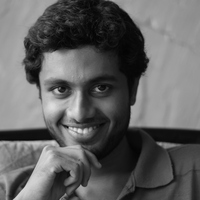

## About Me

Hello! Since September 2016, I'm a Doctoral candidate advised by 
[Prof. Jan K&#345;et&iacute;nsk&yacute;](https://www7.in.tum.de/~kretinsk/) in the Chair for [Foundations of Software Reliability and Theoretical Computer Science](https://www7.in.tum.de/home/index.php) at the [Technical University of Munich](http://www.in.tum.de). My current work revolves around formal methods and verification and lately, its interactions with machine learning. Read more about my [research activities](https://scholar.google.com/citations?user=QHIE7i0AAAAJ).

## Past

Previously, I was a master's student at [Chennai Mathematical Institute](http://www.cmi.ac.in), where I worked under [Prof. B. Srivathsan](http://www.cmi.ac.in/~sri) on _Probabilistic Timed Automata_. Prior to this, I earned a bachelor's degree in [Computer Science and Engineering](http://cse.nitc.ac.in/) from [National Institute of Technology, Calicut](http://www.nitc.ac.in). After a brief stint as a developer at [Commvault Systems](http://www.commvault.com), Hyderabad, I found my way back to academia. I am excited by algorithms and like building tools with strong theoretical frameworks. More on my academic and professional pursuits is detailed in my
[curriculum vitae](PranavAshokCV.pdf).

## Publications

1. P Ashok, K Chatterjee, P Daca, J Křetínský, T Meggendorfer. Value Iteration for Long-run Average Reward in Markov Decision Processes. CAV 2017. ([pre-print](https://arxiv.org/abs/1705.02326)).

## Talks

1. Mean-payoff Objectives for Markov Decision Processes at [QAPL 2017](http://qapl17.doc.ic.ac.uk/). April 2017. [Slides](QAPL-23-April-2017.pdf).
2. Long-Run Average Reward in MDP at DEIS Retreat, Aalborg University. August 2017. [Slides](DEIS-Retreat-Aalborg-9-Aug-2017.pdf).
